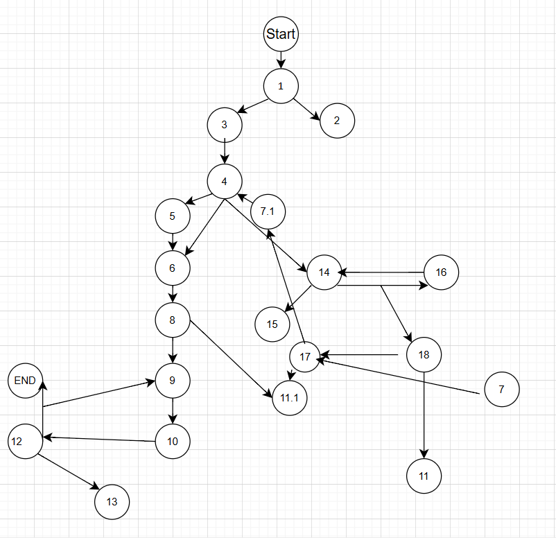

# SI_2025_lab2_236010
Stefanija Grozdanova 236010

# Control Flow Graph

Цикломатска комплексност

За функцијата checkCart, комплексноста ја пресметав со помош на бројот на услови и циклуси во кодот:

1 циклус (for)

6 if-услови:

if (allItems == null)

if (item.getName() == null || item.getName().length() == 0)

if (item.getPrice() > 300 || item.getDiscount() > 0 || item.getQuantity() > 10)

if (item.getDiscount() > 0)

if (cardNumber != null && cardNumber.length() == 16)

if (allowed.indexOf(c) == -1)

Некои од условите користат логички оператори ||, што додава дополнителни патеки.

Формула:
M = број на услови и циклуси + 1 = 10 + 1 = 11
